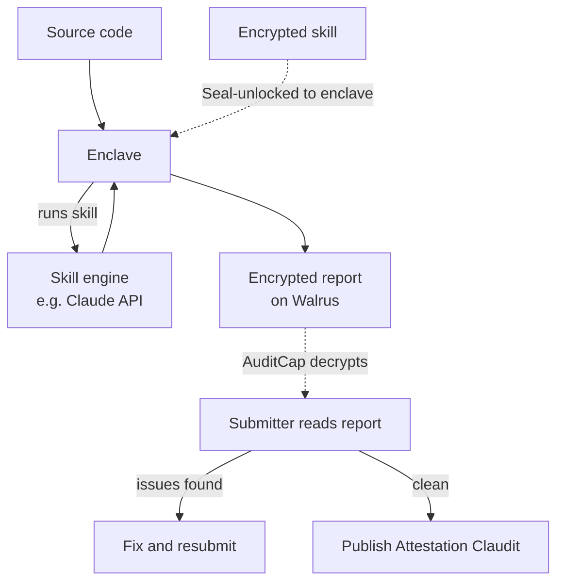
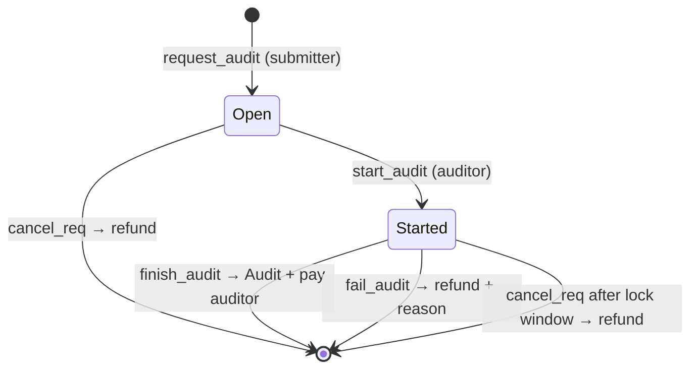
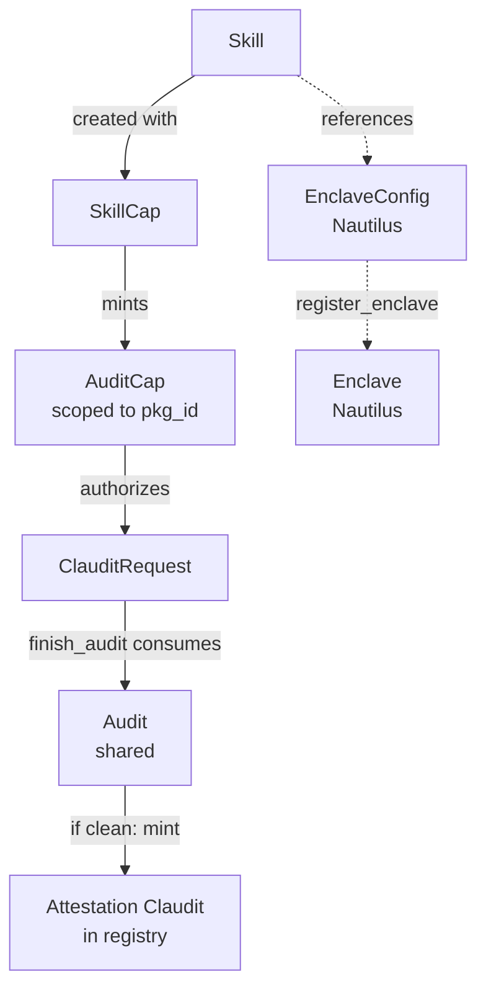

# claudilus — Verifiable Audits on Sui

## Status

Working design doc, rewritten 2026-05-18 after the SkillCap/AuditCap
rework. Sections or items marked **(open)** are still under discussion.

## Overview

claudilus runs audits of Move packages inside AWS Nitro enclaves and
records the results on Sui. The canonical skill runs Claude over a
package's source code, but the framework is skill-agnostic: a "skill"
could equally be the Move Prover, a static analyzer, or a fuzz suite.
What the protocol guarantees is that *a specific, reproducibly-built
enclave ran a specific skill over specific source* — whatever that
skill's internal computation is.

Two roles:

- An **auditor** publishes a `Skill`: proprietary auditing logic
  (encrypted, on Walrus) plus an enclave image (EIF) that runs it. The
  auditor runs the enclave and sets the price.
- A **submitter** holds an `AuditCap` — a per-package capability the
  auditor mints and hands them. With it, the submitter requests audits
  of their package and decrypts the resulting reports. The submitter is
  typically the package owner, but the auditor decides who to mint to.

Each audit — a *claudit* — produces an encrypted report stored on
Walrus. If the package passes, the report carries a signed attestation
the submitter can publish on-chain as a public `Attestation<Claudit>`;
failing audits stay private to the submitter.



### Architecture summary

claudilus is largely a *composition* of existing Sui Stack pieces:
Nautilus for enclave identity, Seal for access-controlled key release,
Walrus for off-chain blob storage, `attestation_registry` for on-chain
discovery, Object Display V2 for rendering, and MVR for package
distribution. The novel parts are a loader EIF, two Move policy modules
(skill access and feedback access), the `Skill`/`SkillCap`/`AuditCap`
type family, and the audit lifecycle objects.

## 1. Trust model (TCB)

Anything in this list can break claudilus's guarantees if it misbehaves:

- **AWS Nitro hardware** — for enclave isolation and the attestation
  signing chain.
- **The loader EIF** — the only code that runs inside the enclave. Must
  be public, reviewable, and reproducibly buildable.
- **The skill's external dependencies** — for a Claude-based skill,
  Anthropic (trusted to run the requested prompt against the requested
  model). Other skill types (Move Prover, static analyzers) have no
  external service in their TCB — they run fully inside the enclave.
  Each skill defines its own external-trust surface.
- **Seal key server threshold** — ≥ t of n servers honest, for both
  skill decryption (enclave side) and report decryption (submitter
  side).
- **Sui validators** — for the integrity of on-chain objects, the
  attestation registry, and payment escrow.
- **The auditor** — holds `SkillCap`, which mints `AuditCap`s and can
  decrypt the skill blob. Compromise lets an attacker mint themselves
  caps or read the skill.
- **The source-validation attestation system** (§5) — claudilus trusts
  source-validation attestations to bind submitted source to a
  published package. This binding is load-bearing for skill-IP
  protection (§6), so the validation system is in claudilus's TCB.

Explicitly *not* in the TCB:

- AWS operators (Nitro prevents operator introspection).
- The parent EC2 instance (untrusted host; sees only encrypted traffic
  over vsock).
- The submitter's identity (the `AuditCap` is the authorization; who
  holds it is what matters, not their address).

## 2. Architecture: Sui Stack composition

| Role | Sui Stack piece |
|---|---|
| Skill ciphertext at rest | **Walrus** blob |
| Enclave image (EIF) at rest | **Walrus** blob |
| Source under audit (private case) | **Walrus** blob |
| Encrypted report at rest | **Walrus** blob |
| Skill / report key release | **Seal** policies in Move |
| Enclave identity & registration | **Nautilus** `enclave` package |
| Attestation index / discovery | **attestation_registry** (existing PoC) |
| Human-readable rendering | **Object Display V2** |
| Distributing the `claudilus` Move package | **MVR** |

The verification primitive for Nitro attestation documents lives in the
**Sui framework** (`sui::nitro_attestation`); Nautilus's `enclave`
package wraps it with a register-once-then-verify-signatures lifecycle
(§3). claudilus builds on Nautilus's package; it does not re-implement
Nitro verification.

## 3. End-to-end lifecycle

### Setup (one-time, by the auditor)

1. Auditor writes the skill and builds the enclave EIF (which bundles
   whatever skill-specific tooling the skill needs — Claude API client,
   Move compiler, etc.). The EIF is public and reproducibly buildable.
2. Auditor Seal-encrypts the skill content and uploads it to Walrus;
   uploads the EIF to Walrus.
3. Auditor creates a Nautilus `EnclaveConfig` recording the EIF's PCRs.
   The Nautilus `Cap` is used here and then becomes inert — claudilus
   does **not** rotate images (see §6, "no rotation").
4. Auditor publishes a `Skill<S>` object on Sui (referencing the skill
   blob, the EIF, and the `EnclaveConfig`; carrying pricing) and
   receives a `SkillCap<S>`.
5. Auditor launches the enclave on AWS. It boots, generates an ephemeral
   Ed25519 keypair, and produces a Nitro attestation over the pubkey.
   Anyone calls `enclave::register_enclave`, which verifies the Nitro
   attestation against the `EnclaveConfig` PCRs and creates a shared
   `Enclave<S>` holding the pubkey.

After setup, all per-audit on-chain verification uses cheap Ed25519
signature checks against the registered `Enclave<S>` — the expensive
Nitro attestation verification happens exactly once, at registration.

### Per-claudit flow

1. **Mint cap.** Auditor calls `mint_audit_cap(&SkillCap, pkg_id)`,
   which returns an `AuditCap<S>` scoped to `pkg_id`. The auditor
   transfers it to the submitter (their customer). This is the
   customer relationship: one cap per (skill, package) the auditor has
   agreed to serve.
2. **Request.** Submitter calls `request_audit`, providing the
   `AuditCap`, the `Source` (§4), a source-validation attestation
   (§5), and the two fee coins. The constructor verifies the
   validation attestation binds the source to `audit_cap.pkg_id`,
   verifies the fees match the skill's posted prices, escrows the
   fees, records the `AuditCap`'s ID, and produces a `ClauditRequest<S>`
   in state `OPEN`.
3. **Start.** The auditor's enclave/scheduler picks up the request.
   Auditor calls `start_audit(&mut request)`: `OPEN → STARTED`, locking
   the request against cancellation for `Skill.lock_window_ms`.
4. **Audit.** The enclave fetches and Seal-decrypts the skill, fetches
   the source (Walrus blob if private, git if public), and runs the
   skill. It produces an encrypted output bundle (§5), uploads it to
   Walrus, and produces a public completion signature.
5. **Finish.** Auditor calls `finish_audit`, presenting the completion
   signature (verified against `Enclave<S>`). This consumes the
   `ClauditRequest`, pays the auditor's `fee`, forwards the storage
   fee to Walrus to book retention, and produces a shared `Audit<S>`.
   *Or* the auditor calls `fail_audit(request, reason)`: consumes the
   request, refunds the submitter, emits a failure event with the
   reason.
6. **Receive.** Submitter decrypts the report by presenting their
   `AuditCap` to the feedback-access `seal_approve` policy (§6),
   getting Seal key shares, and decrypting the Walrus blob.
7. **Publish (optional).** If the verdict is clean, the decrypted
   bundle contains a signed "passed" attestation. The submitter can
   submit it to mint an `Attestation<Claudit>` in the registry —
   the public "passed" signal. Failing audits produce no such
   signature and cannot be published through this path.

If the request is never started, the submitter can `cancel_req` for a
refund at any time. Once `STARTED`, cancellation is blocked until the
lock window expires.



## 4. On-chain types (Move-level sketch)

Field lists are sketches and will evolve. Type parameter `S` is a
per-skill phantom witness type, so an `AuditCap` for one skill cannot
be used with another.



### `Skill<S>`

The auditor's published skill. Pinned to one enclave image and one
skill blob — to change either, the auditor publishes a *new* `Skill`
(see §6, "no rotation").

```move
public struct Skill<phantom S: drop> has key {
    id: UID,
    auditor: address,             // payment destination for audit fees
    skill_blob: vector<u8>,       // Walrus blob ID — encrypted skill content
    enclave_config: ID,           // Nautilus EnclaveConfig for this skill's EIF
    fee: u64,                     // flat per-claudit fee, in MIST
    storage_fee: u64,             // flat per-claudit storage fee, in WAL
    retention_epochs: u32,        // Walrus retention the auditor commits to
    lock_window_ms: u64,          // how long start_audit locks a request
    // ... display metadata, version, etc.
}
```

### `SkillCap<S>`

The auditor's ongoing authority over a skill. Two powers: mint
`AuditCap`s, and decrypt the skill blob (so the auditor can inspect or
re-deploy their own skill). Created alongside the `Skill`.

### `AuditCap<S>`

A per-package capability minted by the auditor and held by a submitter.

```move
public struct AuditCap<phantom S: drop> has key, store {
    id: UID,
    pkg_id: ID,                   // the package this cap authorizes audits of
}

public fun mint_audit_cap<S: drop>(
    _: &SkillCap<S>,
    pkg_id: ID,
    ctx: &mut TxContext,
): AuditCap<S> {
    AuditCap<S> { id: object::new(ctx), pkg_id }
}
```

The `AuditCap` does double duty: it gates `request_audit` (only cap
holders can request audits of that package) *and* gates report
decryption (§6). It is a normal transferable object — the holder can
hand it to a multisig, a successor maintainer, etc.

### `Source`

How the source under audit is supplied to the enclave.

```move
public enum Source has copy, drop, store {
    // Encrypted blob — supports closed-source audits.
    Private { walrus_blob: vector<u8> },
    // A pinned git dependency — public, no decryption needed.
    Public { git_url: vector<u8>, git_sha: vector<u8>, subdir: vector<u8> },
}
```

`Public` source lets the enclave fetch directly with no decryption —
the simpler hot path. `Private` source supports auditing closed-source
packages (the bytecode is still published on chain; only the source is
withheld).

### `ClauditRequest<S>`

A pending audit request. Created by `request_audit`, consumed by
`finish_audit` / `fail_audit` / `cancel_req`.

```move
public struct ClauditRequest<phantom S: drop> has key {
    id: UID,
    pkg_id: ID,
    source: Source,
    source_validation: ID,        // attestation binding source ↔ pkg_id (§5)
    audit_cap_id: ID,             // ID of the AuditCap used — gates decryption (§6)
    funder: address,              // refund destination
    fee_paid: Balance<SUI>,
    storage_paid: Balance<WAL>,
    state: RequestState,
    created_at_ms: u64,
}

public enum RequestState has copy, drop, store {
    Open,
    Started { started_at_ms: u64 },
}
```

The constructor (`request_audit`) requires an `&AuditCap<S>` and a
source-validation attestation; it checks the cap's `pkg_id`, the
attestation's source↔package binding, and exact fee amounts. It records
`object::id(audit_cap)` so report decryption can later be gated to that
exact cap.

### `Audit<S>`

A completed audit. A shared object so its existence is publicly
discoverable; produced by `finish_audit`, which consumes the
`ClauditRequest` and carries its durable fields forward.

```move
public struct Audit<phantom S: drop> has key {
    id: UID,
    pkg_id: ID,
    request_id: ID,               // former ClauditRequest ID — the Seal identity
    audit_cap_id: ID,             // gates report decryption (§6)
    source_validation: ID,
    report_blob: vector<u8>,      // Walrus blob ID — the encrypted report
    completed_at_ms: u64,
}
```

The `request_id` is carried forward because the report's Seal
encryption identity is `bcs(request_id)` (chosen at audit time, when
the `ClauditRequest` still existed). The feedback-access policy needs
it after the request is consumed.

### `Attestation<Claudit>`

An instance of the generic `Attestation<T>` from `attestation_registry`,
specialized with claudilus's `Claudit` payload. Minted only for clean
audits, by submitting the signed "passed" attestation extracted from a
decrypted report. Its *existence* for a package is the public "passed"
signal; the payload is metadata-only.

```move
public struct Claudit has store {
    pkg_id: ID,
    source_hash: vector<u8>,      // what was audited
    source_path: vector<u8>,      // human-readable locator (git path, etc.)
    skill_id: ID,                 // how — which skill
    enclave_id: ID,               // which registered enclave produced it
    skill_content_hash: vector<u8>,
    report_blob: vector<u8>,
    completed_at_ms: u64,
}
```

### Nautilus enclave types

Provided by Nautilus's `enclave` package; claudilus does not redefine
them.

- **`EnclaveConfig`** — records the authorized PCRs for the skill's
  EIF. Set once at setup; never updated (no rotation).
- **`Enclave<S>`** — a registered enclave instance, holding the
  enclave's Ed25519 pubkey. Created by `register_enclave` from a valid
  Nitro attestation. Per-audit verification checks Ed25519 signatures
  against this object.

## 5. Off-chain components

### Loader EIF

The only code that runs inside the enclave. Built on Nautilus's
`nautilus-server` Rust template (parent-EC2 HTTPS forwarding,
`get_attestation` endpoint, ephemeral key generation, IntentMessage
signing), with the claudilus app slot carrying the skill-specific
logic and tooling. Notably it has **no Sui keypair** — it produces an
encrypted bundle plus Ed25519 signatures and lets the auditor submit
the Sui transactions.

The enclave is **policy-agnostic**: it encrypts the report under Seal
identity `bcs(request_id)` and points Seal at the skill's
feedback-access policy module. It has no notion of `AuditCap` or any
other authorization shape — that is entirely the policy module's
concern, so a skill author can swap policies without rebuilding the
EIF.

### Encrypted skill blob

A Walrus blob, Seal-encrypted so the key releases only to the
registered enclave (the skill-access policy verifies an Ed25519
signature against `Enclave<S>`). The skill content — prompt template,
tooling config, scoring rubric — is confidential auditor IP. Only the
enclave (at runtime) and the auditor (via `SkillCap`) can decrypt it.

### Encrypted output bundle

One Walrus blob per claudit, Seal-encrypted under the feedback-access
policy with identity `bcs(request_id)`. Contents:

- The audit report (verdict + findings + natural-language detail),
  signed by the enclave.
- **If and only if the verdict is clean:** a signed "passed"
  attestation — the material needed to mint an on-chain
  `Attestation<Claudit>`. Failing audits omit it, so a failing audit
  structurally cannot produce an on-chain "passed" signal.

Alongside the bundle, the enclave produces a **public completion
signature** over `IntentMessage{Completion, ts, request_id}` — used by
`finish_audit` to verify the audit ran. It carries no content and no
token count.

### Source validation

claudilus audits *source*, but access is gated by *published package
ID* (the `AuditCap` is scoped to a `pkg_id`). For that gate to be
meaningful, claudilus must be sure the submitted `Source` actually
corresponds to the package — otherwise an `AuditCap` for a trivial
package becomes a general-purpose "run the skill on anything" license,
which would let an attacker characterize the skill by feeding it
arbitrary inputs (§8).

claudilus does **not** perform source validation itself. Instead, it
*requires a source-validation attestation as input* to `request_audit`.
That attestation — "source with hash H compiles to package P's
on-chain bytecode" — is produced by a separate system built on the
same claudilus pattern, with the Move compiler as its skill. It lives
in the same `attestation_registry`. This is attestations composing
with attestations: the audit request consumes a validation attestation
and produces an audit attestation. There is no infinite regress — the
validation skill takes source + claimed package and *produces* the
correspondence proof; it needs no prior validation.

## 6. Access control and privacy

### Why encrypt audit outputs

The audited source is generally public (or at most a candidate version
the team plans to ship), so the only proprietary content in a report is
*what the skill found*. Over many audits, anyone who can read outputs
can characterize what a skill checks for — eroding the auditor's
proprietary edge. So the artifact under access control is the report,
but the *reason* it's protected is the skill IP behind it, and the
auditor is the policy authority.

### Skill privacy

Skill content is private from submitters, AWS operators, and chain
viewers — though not from the skill's external dependencies (an
AI skill's prompts are visible to Anthropic). The Seal sealed-load
pattern achieves this without breaking public verifiability of the
enclave image: the EIF is fully public; the skill plaintext exists
only in enclave memory at runtime. The on-chain `skill_content_hash`
lets anyone verify *which* skill version produced an audit without
seeing *what* it says.

### Encryption-by-default for audit outputs

The entire output bundle is Seal-encrypted. The on-chain
`Attestation<Claudit>` is metadata-only and exists only for clean
audits — so a chain observer sees "package P passed an audit" but
never a verdict bit for a failing one, and never any findings content.
This closes the oracle-attack channel (§8): completed audits aren't
observable as pass/fail signals.

### Reference feedback-access policy

claudilus ships one reference `seal_approve` policy: decryption is
gated on holding the *exact* `AuditCap` that requested the audit.

```move
entry fun seal_approve<S: drop>(
    id: vector<u8>,               // Seal identity = bcs(request_id)
    audit: &Audit<S>,
    cap: &AuditCap<S>,
    _ctx: &TxContext,
) {
    // Identity binding: the Audit presented must match the encryption's identity.
    assert!(bcs::to_bytes(&audit.request_id) == id, ENoAccess);
    // Cap binding: caller holds the exact AuditCap that requested this audit.
    assert!(object::id(cap) == audit.audit_cap_id, ENoAccess);
}
```

Tying decryption to the *specific requesting cap* (not "any cap for the
package") has a clean consequence: the auditor cannot mint a fresh
`AuditCap` later and use it to read old reports — old reports are bound
to old cap IDs, and the auditor gave those caps away (Sui objects can't
be copied). No timestamp or issuance-time gate is needed; the binding
is structural.

One nuance: a single `AuditCap` used for N requests means all N reports
decrypt under that one cap. A submitter wanting per-audit isolation
(e.g., to share one report without exposing the others) requests those
audits under separate caps. Granularity of isolation = granularity of
cap minting.

**Per-report Seal identity.** The identity is `bcs(request_id)` —
unique per audit. This keeps the enclave policy-agnostic (it commits to
a unique tag and doesn't encode any authorization assumption), and each
decryption is its own `seal_approve` call.

**Skill author visibility.** If the auditor wants to read reports, they
mint an `AuditCap` for the relevant package to their own address — they
are then just another cap holder. There is no separate "view cap." Note
this is not a credible *non*-visibility commitment: the auditor holds
`SkillCap` and can always mint another cap, though only for *future*
audits — past reports stay bound to the caps that requested them.

### No rotation

A `Skill` is pinned to one enclave image and one skill blob. There is
no upgrade or rotation mechanism — to change the image or the skill,
the auditor publishes a *new* `Skill`. This is deliberate: an
attestation from image X and one from image Y are genuinely
incomparable artifacts, and a rotation mechanism would paper over that.
"Upgrading a skill" is just publishing a new skill. (Continuity of
*reputation* across an auditor's skill versions is a real need, but a
cross-cutting one — see §9.)

### Alternative policies

The reference policy is just one authorization contract. Because
`seal_approve` is an ordinary Move function and the enclave is
policy-agnostic, an auditor can write any policy they want — and the
framework supports it without changes. Examples:

- **Decryption licenses sold separately** — findings monetized to
  multiple buyers (bug-bounty-market shape).
- **Tiered detail** — cheap summary, paid full report.
- **Subscription / DAO-gated** — membership-token holders decrypt.
- **Time-locked disclosure** — anyone can decrypt after N days.
- **Issuance-time-gated caps** — caps carry an `issued_at`, and
  decryption is gated on the cap predating the report. Gives a
  "no retroactive access" guarantee; costs indexing infrastructure to
  verify, and reports created before any cap exists become permanently
  unreadable.

## 7. Payment and failure semantics

### Two flat fees

Each claudit has two flat fees, both set canonically by the auditor on
`Skill<S>` and verified exact at `request_audit`:

- **`fee` (SUI)** — paid to the auditor at `finish_audit`.
- **`storage_fee` (WAL)** — forwarded to Walrus at `finish_audit` to
  book the report blob for `retention_epochs`. WAL-denominated so
  there's no in-protocol SUI↔WAL conversion.

**Flat, not metered.** Per-token billing would require the enclave to
publish a token count, which is a proxy for audit complexity and could
leak information about the content. Flat fees keep settlement
disclosure minimal — "an audit completed for this request," nothing
more. The auditor absorbs cost variance across audits.

### Settlement

`finish_audit` is a PTB that verifies the completion signature against
`Enclave<S>`, consumes the `ClauditRequest`, transfers `fee_paid` to
`Skill.auditor`, forwards `storage_paid` to Walrus's storage primitive
(booking `retention_epochs` for the report blob), and produces the
shared `Audit<S>`. All atomic. Settlement does not mint an
`Attestation<Claudit>` — publication is the submitter's separate,
optional choice (§3 step 7).

### Failure paths

- **`fail_audit`** — the auditor declares a request unfulfillable
  (external API down, source rejected, capacity, etc.). Consumes the
  request, refunds both fees to the `funder`, emits a failure event
  with a reason string. Unilateral auditor option; reputation is the
  check on misuse.
- **`cancel_req`** — the submitter reclaims a stuck request. Allowed
  while `OPEN`, or while `STARTED` after the lock window has expired.
  Refunds both fees, consumes the request.
- **No wall-clock timeout.** A request sits until started, finished,
  failed, or cancelled. The submitter monitors and cancels when they
  decide a request is stale.

The `STARTED` lock exists so an auditor mid-audit isn't cancelled out
from under them; `lock_window_ms` (set on `Skill`) bounds how long that
protection lasts before the submitter regains the ability to cancel.

## 8. Threats considered

### Oracle attack via commissioned audits

The threat: an attacker learns about flaws in target code by
repeatedly submitting variants and watching the pass/fail signal (a
single bit per variant is enough to bisect; findings transfer to
similar code).

Mitigations:

- **`AuditCap` gating + source validation.** Requesting an audit needs
  an `AuditCap` for a specific package, and the submitted source must
  validate against that package's bytecode. So an attacker can only
  audit code that genuinely corresponds to a package they hold a cap
  for. They cannot point the skill at arbitrary code.
- **Encryption-by-default.** Completed audits reveal no verdict bit on
  chain; a clean audit produces an `Attestation<Claudit>` only if the
  submitter chooses to publish.
- **Per-request payment** throttles even an attacker who is auditing
  their own genuine packages.

Residual: an attacker who controls a package and holds its `AuditCap`
can still audit successive versions of *their own* code and learn from
the results — but that is the service working as intended, not an
attack.

### Skill characterization without source validation

If source validation were skipped, an `AuditCap` for any trivial
package would let the holder run the skill on arbitrary inputs and
characterize its behavior. This is why source validation is
load-bearing for skill-IP protection and the validation system is in
the TCB (§1, §5).

### Auditor key compromise

Compromise of `SkillCap` lets an attacker mint `AuditCap`s and decrypt
the skill blob. Mitigations: multisig governance of `SkillCap`,
key-rotation hygiene. Note this does not let the attacker forge audit
results — those require the enclave's Ed25519 key, which never leaves
the enclave.

### Walrus blob expiration

The submitter pays for `retention_epochs` of storage at request time.
After that window, a report blob decays unless renewed. A published
`Attestation<Claudit>` keeps its commitment hashes but loses the
recoverable plaintext; the on-chain "passed" signal still stands.
Long-tail renewal is out of scope for v1.

## 9. Open design questions

1. **Reputation / issuer-identity layer.** "Who issued this
   attestation, and how does their identity persist as their skills
   evolve" is a cross-cutting concern across all attestation types, not
   a claudilus-specific one. Deliberately deferred: claudilus produces
   concrete attestations carrying enough identifying facts (enclave ID,
   skill hash, etc.) that a future general reputation layer can
   attribute and cluster them. The right shape for that layer becomes
   designable once there are two or three attestation types to
   generalize from (claudilus audits + source-validation being the
   first two).

2. **`SkillCap` governance shape.** Single-sig (PoC default), multisig,
   DAO? Trade-off between operational agility and compromise blast
   radius.

3. **EIF build tooling.** Starting point is Nautilus's `Containerfile`
   + `configure_enclave.sh`. Open whether that gives sufficient build
   determinism or whether to layer in nix/kaniko.

4. **Failure-with-response publication.** There is no on-chain path to
   publish a *failing* claudit (intentional — publication = passed).
   An auditee who wants to publicly acknowledge a failed audit with a
   remediation note has no built-in mechanism. Possible follow-on.

5. **`lock_window_ms` calibration.** It lives on `Skill`, but the right
   default value depends on the skill's typical turnaround.

6. **Persistent failed-audit records.** `fail_audit` currently emits an
   event with a reason string and keeps no object. A persistent
   `FailedAudit` record could be useful (dispute trails) but adds
   surface.

7. **Seal + Nautilus composition details.** The register-once /
   sign-cheap pattern is sound, but the exact `seal_approve` plumbing
   and at-boot secrets handling are under-documented upstream (captured
   in the project's docs-feedback file).

## 10. References

- `attestation_registry/sources/attestation_registry.move` — the
  registry claudilus plugs into.
- `audit_example/sources/audit.move` — example consumer; the `Claudit`
  payload type follows the same Permit-gated `register_display`
  pattern.
- AWS Nitro Enclaves documentation — EIF, PCRs, attestation format.
- Mysten Labs Nautilus repo — `enclave` Move package, `nautilus-server`
  template, `seal-policy` example.
- Mysten Labs Seal repo — `seal_approve` policy patterns.
- Mysten Labs Walrus docs — blob storage lifecycle and pricing.
